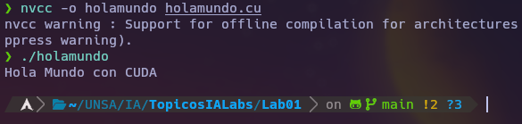
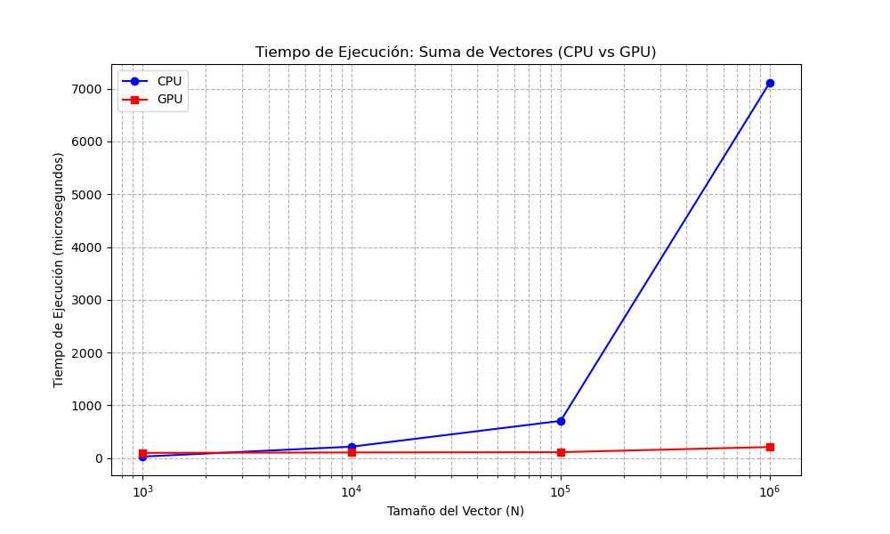

# Laboratorio 01

## Por: Paul Parizaca Mozo

Este laboratorio explora los fundamentos de CUDA con tres ejercicios prácticos: un "Hola Mundo" en CUDA, la suma de vectores en CPU y en GPU, comparando tiempos de ejecución para diferentes tamaños de vectores (1000, 10000, 100000, 1000000 elementos). El objetivo es analizar el rendimiento de CPU vs. GPU en tareas de cálculo intensivo.

## Ejercicios

### Ejercicio 1: Hola Mundo en CUDA

Implementación básica de un "Hola Mundo" desde un kernel CUDA para verificar su funcionamiento.

- **Captura**:  
  

### Ejercicio 2: Suma de Vectores en CPU

Programa en C++ que suma dos vectores en CPU, midiendo tiempos para distintos tamaños.

- **Capturas**:
  - [1000 elementos](img/ejer2_1000.png)
  - [10000 elementos](img/ejer2_10000.png)
  - [100000 elementos](img/ejer2_100000.png)
  - [1000000 elementos](img/ejer2_1000000.png)

### Ejercicio 3: Suma de Vectores en GPU

Suma de vectores en GPU con CUDA, comparando tiempos con la CPU.

- **Capturas**:
  - [1000 elementos](img/ejer3_1000.png)
  - [10000 elementos](img/ejer3_10000.png)
  - [100000 elementos](img/ejer3_100000.png)
  - [1000000 elementos](img/ejer3_1000000.png)

## Análisis

Tiempos de ejecución (en microsegundos):

| Tamaño (N) | CPU (μs) | GPU (μs) |
| ---------- | -------- | -------- |
| 1000       | 29       | 99       |
| 10000      | 217      | 107      |
| 100000     | 705      | 112      |
| 1000000    | 7113     | 210      |

- **Gráfica**:  
  

La CPU es más rápida para vectores pequeños (1000), pero la GPU supera ampliamente a la CPU en tamaños grandes (hasta 34 veces más rápida con 1000000 elementos).

## Conclusiones

- La CPU es eficiente para tareas pequeñas por menor overhead.
- La GPU destaca en cálculos paralelos masivos, ideal para problemas grandes como en IA.
- Elegir entre CPU y GPU depende del tamaño y naturaleza de la tarea.

## Código

Disponible en:  
[https://github.com/PaulParizacaMozo/TopicosIALabs/tree/main/Lab01](https://github.com/PaulParizacaMozo/TopicosIALabs/tree/main/Lab01)
